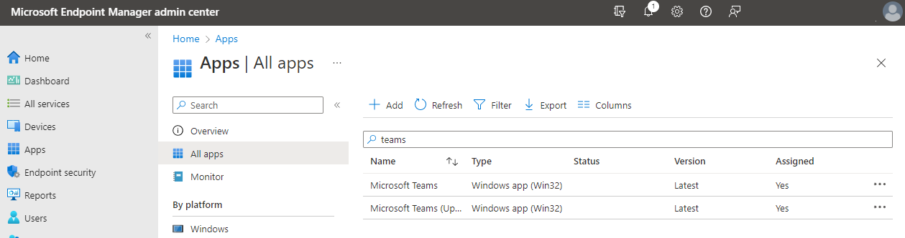
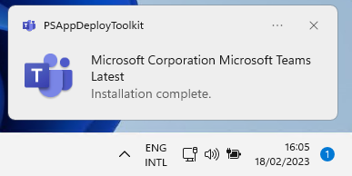
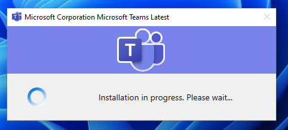

# Description:
This is a package made for microsoft teams in intune.

# Including: 
- Install (using winget)
- Uninstall
- Configuration
- Uploadscript for Intune

# How to use:
Download the folder to your local system and run the powershell script "Upload to intune.ps1". 
It will install all the required modules and prompt you for the tanent ID (CompanyName.OnMicrosoft.com) and later a account with permission to administrate intune. 

The script will create two deployments in intune
- Microsoft Teams
- Microsoft Teams (upgrader)

The first deployment "Microsoft Teams" is the deployment to assign to the users or devices that need to have microsoft teams installed.
The second deployment "Microsoft Teams (Updater)" makes sure that the application is always up to date. Assign this to the computers or users who need to be kept up-to-date as required.

## A Example deployment

Lets say: You want to make microsoft teams available to all members of IT and Marketing and keep them up to date but if someone else has already installed Teams also make sure that they are also updated.

AAD group: AppGroup_MicrosoftTeams
Members: All_MarketingUsers, All_ITUsers

Microsoft teams
Deployment: 
- Available: AppGroup_MicrosoftTeams
- Required : None
Microsoft Teams (Upgrader)
Deployment: 
- Available : None
- Required : All Users

With this setup the users of Marketing and IT can go to the company portal and install teams like they are used to and intune checks all users if teams is installed, and if it is installed but out of date updates teams for them.

# How does this look (admin side):
The Admin gets two new packaging in the portal

These packages can be assigned to users or devices. 
The "Microsoft Teams" package should be assigned to the users that want to install the software (as available or required)
The "Microsoft Teams (Updater)" Should be assigned to the users or devices that need to be kept up to date as required.

The packages already have all needed information and configuration.

# How does this look (client side):
The user can install the software from the company portal.

If the user has teams installed but it is out-of-date it will be updated. if the user is not using teams at that moment the update will happen without interupting the user.
If the user has teams active they will be prompted to close the application or defer the installation

and while the installation is going on they will get a progress message

Then when the update is finished teams will automaticaly be restarted and the user can continue.

