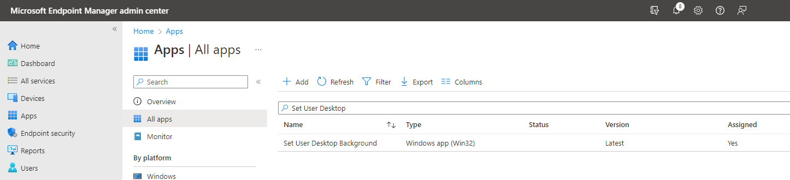

# Status
|status|name|
|--|--|
:white_check_mark:|Company portal view 
:black_square_button:|Install
:black_square_button:|Uninstall

:white_check_mark: = Finished and tested
:black_square_button: = Finished 

# Description:
This is a package made to set the desktop of the user.  
Desktop will only be changed ones, the user can still change it.

# Including: 
- Install
- Uninstall
- Uploadscript for Intune

# How to use:
1.) Download the folder to your local system
1.) run the powershell script `"Upload to intune.ps1"`. 
It will install all the required modules and prompt you for the 
1.) Input tanent ID (CompanyName.OnMicrosoft.com) and later a account with permission to administrate intune. 
1.) Input link to the desktop.

The script will create one deployments in intune
- Set User Desktop Background

Assign this to the computers or users who need have there desktop changed.

## A Example deployment

Lets say: You want to set the users desktop background for all members of IT and Marketing.

AAD group: AppGroup_CompanyWallpaper
Members: All_MarketingUsers, All_ITUsers

Set User Desktop Background
Deployment: 
- Available: None
- Required : AppGroup_CompanyWallpaper

With this setup the users of Marketing and IT will have their desktop wallpaper set to the company background, if they want they can later change it.

# How does this look (admin side):
The Admin gets one new packaging in the portal.

This package can be assigned to users or devices. 
The "Set company background" package should be assigned to the users that want to install the software (as available or required)

The packages already have all needed information and configuration.

# How does this look (client side):
Nothing is showed to the user, only the desktop will be changed.
